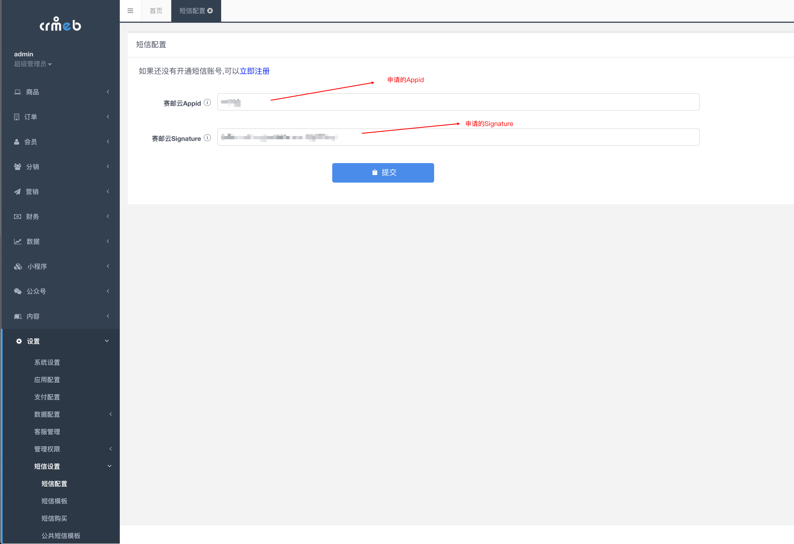
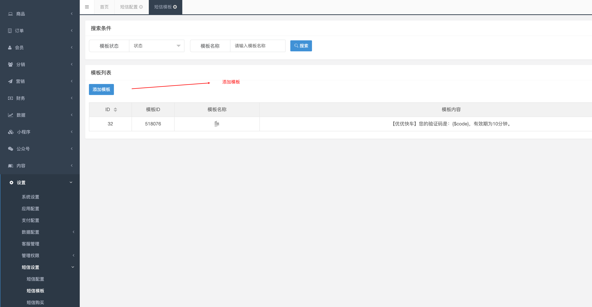

## OVERVIEW

### CRMEB短信 Plug-Ins Overview

>CRMEB是西安众邦科技旗下的基于客户关系管理和电子商务应用场景电销管理系统。
------
CRMEB [官网地址](https://www.crmeb.com)
	
文件路径

-	app/admin/controller/sms/SmsConfig.php
-	app/admin/controller/sms/SmsTemplateApply.php
-	app/admin/model/sms/SmsRecord.php
-	app/admin/view/sms/sms_config/index.php
-	app/admin/view/sms/sms_template_apply/index.php
-	crmeb/services/sms/storage/Yunxin.php
-	crmeb/services/SMSService.php

	1.将插件内的文件覆盖至你的网站系统根目录
	2.进入系统后台->设置->短信设置，填写赛邮云短信相关的账号密码
	3.进入系统后台->设置->短信设置->添加模板，填写所需模板

	模板实例（从左到右依次为模板id，模板名称，模板内容）
			518076   通用验证码 【特产商城】您的验证码是：{$code}，有效期为1分钟。如非本人操作，可不用理会。
			520268   支付成功提醒【特产商城】您购买的商品已支付成功，支付金额{$pay_price}元，订单号{$order_id},感谢您的光临！
			520269  发货提醒【特产商城】亲爱的用户{$nickname}您的商品{$store_name}，订单号{$order_id}已发货，请注意查收
			520271  确认收货提醒【特产商城】亲，您的订单{$order_id},商品{$store_name}已确认收货,感谢您的光临！
			520272  管理员下单提醒【特产商城】{$admin_name}管理员，您有一笔已支付的订单待处理，订单号为{$order_id}！
			520273  管理员支付成功通知【特产商城】{$admin_name}管理员,您有一笔支付成功的订单待处理，订单号{$order_id}!
			520274  管理员退款通知 【特产商城】{$admin_name}管理员,您有一笔退款订单待处理，订单号{$order_id}!
			520422  管理员确认收货通知【特产商城】{$admin_name}管理员,您有一笔订单已经确认收货，订单号{$order_id}!

	4：短信模板配置，选择添加模板

[Github项目地址](https://github.com/submail-developers/crmeb_sms) &nbsp;&nbsp;&nbsp; [点击下载](https://github.com/submail-developers/crmeb_sms/archive/master.zip)

